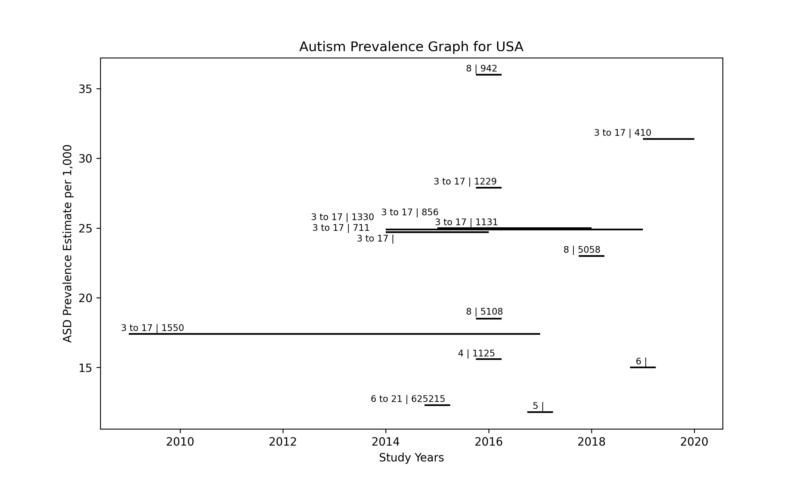
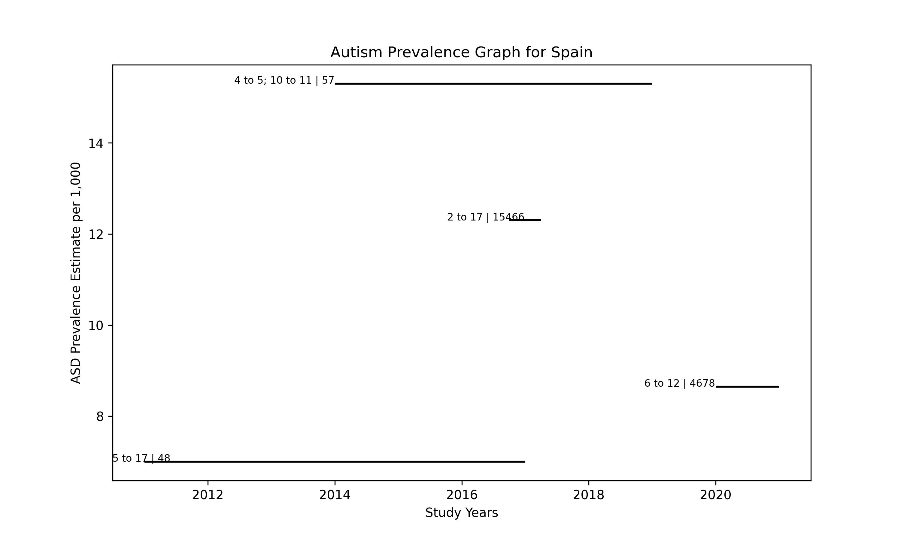

# autism
This is under review.

autism prevalence visualization with generative AI

Renamed csv file: autism_prevalence_studies.csv

autism2.py: Python program generated by AI.

Generative AI is used for visualizing austism prevalence of a country with CDC dataset 
while user is allowed to select one of countries interactively.

Initial query to AI: XXX

Generated figures for autism prevalence in the US and Spain: left number(age range)|cases

